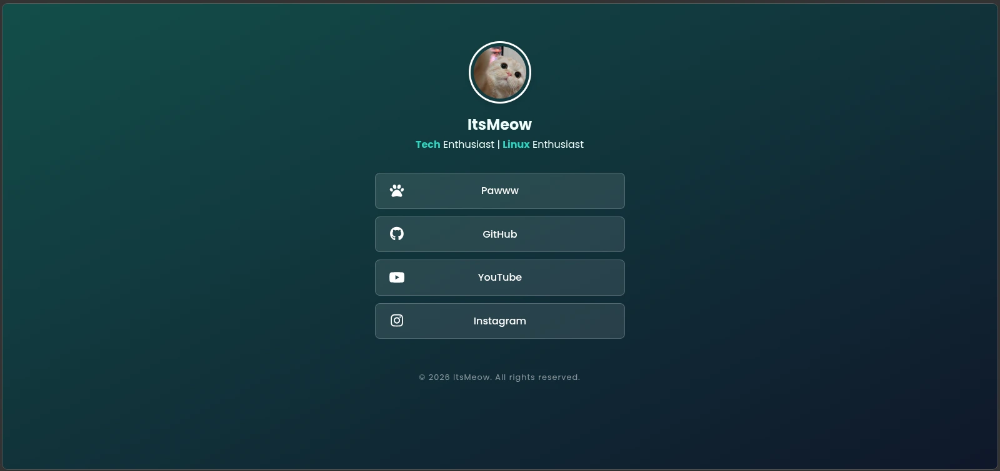

# Linktree Profile - Personal Portfolio

A simple, clean, and modern Linktree-style profile page built with vanilla HTML, CSS, and JavaScript. Featuring a sleek glassmorphism design and smooth staggered animations.

## Features
* **Glassmorphism Design**: Modern UI with frosted glass effects and gradients.
* **Staggered Animations**: Buttons appear one-by-one with a smooth slide-up effect.
* **Auto-Updating Footer**: JavaScript automatically updates the copyright year.
* **Responsive Layout**: Optimized for both mobile and desktop views.
* **Clean Code**: Separated HTML, CSS, and JS for better maintainability.

## Technologies Used
* HTML5
* CSS3 (Flexbox & Keyframe Animations)
* Vanilla JavaScript
* [Fontawesome](https://fontawesome.com/) (for iconography)

## How to Use
1. Clone this repository.
2. Replace `assets/profile.jpeg` with your own photo.
3. Update the links and social media handles in `index.html`.
4. Open `index.html` in your browser or deploy it to GitHub Pages.

## License
&copy; 2026 ItsMeow. All rights reserved.
